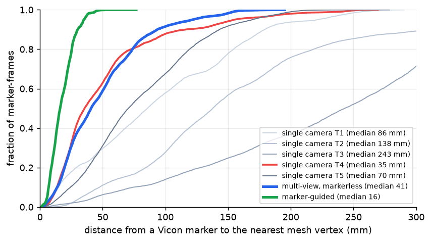
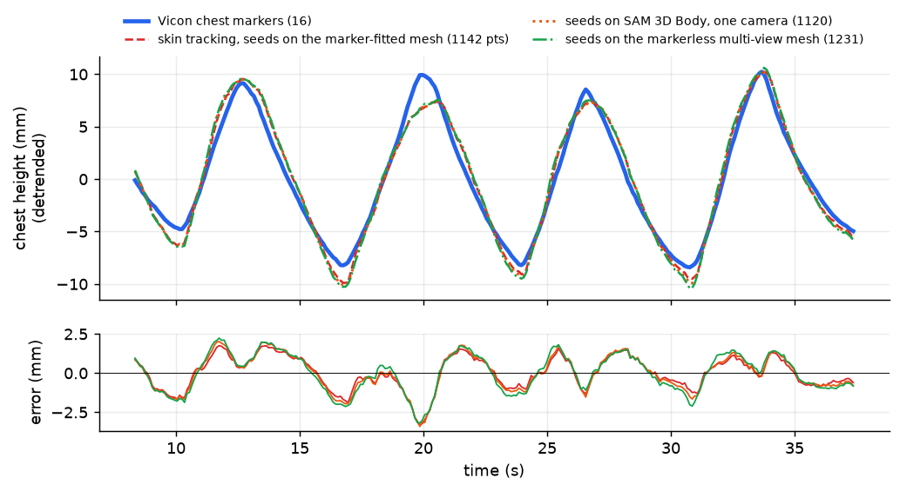
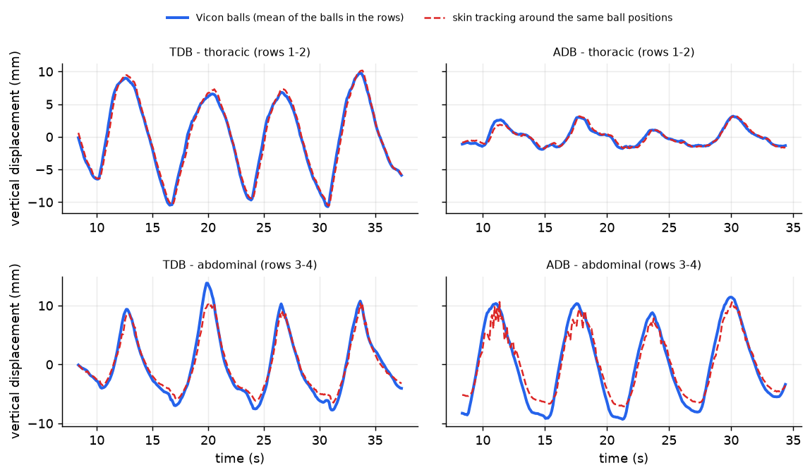
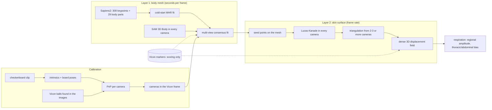

# multi-view-breathing-mesh

**Markerless multi-view body-mesh fitting and skin-surface tracking for respiration monitoring in surface-guided radiotherapy (SGRT), validated against Vicon motion capture on healthy volunteers lying supine in treatment position.**

Six calibrated GoPro cameras look at a supine volunteer. The code in this repository builds, step by step, a markerless estimate of (1) the body mesh and (2) the motion of the skin surface, scores both against a Vicon marker "ground truth", and uses the result to ask a clinical question: *does the patient breathe with the chest or with the abdomen?*

> **Status: research code, one participant (MMC17), two breathing maneuvers.** Everything below is a measurement on that data, not a validated clinical system. Numbers are reproduced from the scripts in `mv/`; every experiment lists its caveats. **No study data, videos or participant images are included** (see [Data and privacy](#data-and-privacy)).

---

## Results at a glance

| Question | Result | Experiment |
|---|---|---|
| Can the six cameras be calibrated into the Vicon frame? | Yes: checkerboard + Vicon balls found in the images, PnP RMS 1-2 px per camera (T6 is unsynchronised and excluded) | [calibration](docs/EXPERIMENTS.md#calibration-and-registration) |
| How good is one-camera SAM 3D Body? | 36 mm (best camera) to 243 mm (worst) median distance to the Vicon markers, **114 mm for a typical camera**. The dominant error is **depth**: the body is placed 13-31 cm too far from the camera in 4 of 5 views | [mesh](docs/EXPERIMENTS.md#body-mesh), [depth](docs/EXPERIMENTS.md#why-the-marker-guided-fit-is-better) |
| Does a markerless multi-view fit help? | **41 mm** median (3x better than a typical camera, about equal to the best one, without knowing which that is). It does not improve the chest breathing signal | report 16 |
| What does the marker-guided fit (Vicon markers as 3D anchors) reach? | 16 mm median to the markers in the nearest-vertex metric used here (10 mm to the surface at the fitted markers, so partly training error; the held-out-marker test is in [experiments](docs/EXPERIMENTS.md#why-the-marker-guided-fit-is-better)) | reports 7-14, 19 |
| Can Sapiens2 replace the markers as 3D anchors? | **Partly.** Triangulated from five views, its keypoints put knees / ankles / wrists **24-35 mm** from Vicon-derived joint proxies (130-220 mm for SAM 3D Body's own skeleton). A mesh fitted only to them is 22 mm from the markers overall (limbs and head 13-23 mm, against 44-64 mm for the multi-view consensus) but its **abdomen floats 7-9 cm above the skin** and it cannot seed skin tracking; mask and consensus variants are being tested | [Sapiens2](docs/EXPERIMENTS.md#sapiens2-cold-start) |
| Can the skin surface be tracked without markers? | Yes, to **~1 mm**: multi-camera Lucas-Kanade on skin and fabric texture with the reflective balls *painted out of the video*: r = 0.985, MAE 0.85 mm against the 16-ball chest array, 1,142-5,500 triangulated 3D points | reports 13, 15, 17 |
| ...with no Vicon information in the tracking? | MAE 1.0 mm when the seed points are placed on the markerless multi-view mesh | report 17 |
| Do abdominal- and thoracic-directed deep breathing differ, as seen by skin tracking? | Regional bias B (thoracic / abdominal amplitude): **0.30 (ADB) vs 1.04 (TDB)** from video only; Vicon on the same trials 0.29 vs 0.86. Per-ball amplitude agreement r = 0.89 | [report 18](docs/EXPERIMENTS.md#abdominal-vs-thoracic-deep-breathing) |


*Distance from every Vicon marker to each mesh (cumulative, 146 frames): the five single-camera SAM 3D Body meshes, the markerless multi-view mesh (blue) and the marker-guided mesh (green).*


*Chest height from 1,100+ tracked skin points (balls painted out of the video) against the Vicon chest array; three kinds of seed points.*


*Thoracic (rows 1-2) and abdominal (rows 3-4) displacement over the trial, Vicon balls vs skin tracking around the same positions, for thoracic-directed (TDB) and abdominal-directed (ADB) deep breathing.*

---

## The idea: two layers

Respiration is a ~1 cm surface motion; a body-pose network is wrong by several centimetres. So the pipeline separates the two:



* **Layer 1 (coarse, low rate):** a full body mesh in the room frame (MHR, the body model inside SAM 3D Body). Monocular networks place the body well in each image but not in depth; five calibrated views, Sapiens2 keypoints and a multi-view fit repair that.
* **Layer 2 (fine, high rate):** dense tracking of the skin/fabric texture in every camera, triangulated to a 3D displacement field. It is accurate to ~1 mm but needs seed points to start from, which Layer 1 provides.
* **Vicon is the yardstick only:** it is used to calibrate the cameras and to score every result, never inside the markerless estimates (the marker-guided fit that does use it is the reference, and its limits are quantified).

## What is in the repository

```
mv/                  all code (flat modules; run from this folder)
  calibration        calib_*.py, adb_geometry.py, adb_extrinsics.py, vicon_calib*.py, marker_detect.py, mvcal.py
  body mesh          sam3d_mv.py, mv_collect.py, mv_fit.py, marker_fit.py, track_fit.py, sap_fit.py, sapiens2_run.py
  scoring            mv_eval*.py, err_decompose.py, marker_holdout.py, dark_clothing_test.py, sap_triangulate.py, sap_eval.py
  skin tracking      chest_points*.py, chest_lk_masked.py, chest_eval.py, skin_frames.py, run_lk_trial.sh
  analysis           thoracoabdominal_vicon.py, thoracoabdominal_markerless.py, breathing_stats.py
  recordings         make_*_rrd.py (Rerun 0.38 files)
  reports            make_reports.py + report_*.py (one HTML page per experiment; not included here, see below)
  trial_io.py        which trial (TDB / ADB) a script works on (env TRIAL) and where its files live
docs/
  EXPERIMENTS.md     the 20 experiments: what was done, what was found, caveats
  SETUP.md           environments, external repositories, expected data layout
  figures/           numeric result plots (no participant imagery)
requirements/        pip freeze of the three Python environments
```

## Setup in brief

Three Python environments (details and install commands in [docs/SETUP.md](docs/SETUP.md)); the machine used was Windows 11 with an RTX 4060 (8 GB):

| Environment | Python / torch | Used for |
|---|---|---|
| InstantHMR env | 3.12, torch 2.6 cu124, onnxruntime-gpu 1.22, rerun-sdk 0.38 | geometry, tracking, analysis, reports, Rerun files |
| SAM3D env | 3.11, torch 2.5.1 cu124 | SAM 3D Body / MHR (mesh fitting) |
| Sapiens2 env | 3.12, torch 2.11 cu128 | Sapiens2 pose and body-part segmentation |

External code (cloned separately, paths set by environment variables `SAM3D_REPO`, `INSTANTHMR_REPO`, `SAPIENS2_REPO`): [Fast-SAM-3D-Body](https://github.com/yangtiming/Fast-SAM-3D-Body) (SAM 3D Body + MHR), [InstantHMR](https://github.com/mohamdev/InstantHMR), [Sapiens2](https://github.com/facebookresearch/sapiens2). Model weights come from their Hugging Face repositories. The scripts expect the data under `CUTrial/` at the repository root (override with `SGRT_ROOT`).

## Reproducing the main results

All commands are run from `mv/`. `TRIAL=TDB` (default) or `TRIAL=ADB` selects the breathing trial.

```bash
# 1. camera geometry: checkerboard clip -> shared intrinsics + board poses -> Vicon-frame extrinsics from the balls
python calib_extrinsics.py ; python calib_v3.py ; python vicon_calib.py   # order, inputs and the T6 recovery: docs/SETUP.md
# raw (not stabilised) video, e.g. the ADB trial:
python adb_geometry.py fit ; python adb_geometry.py align ; python adb_extrinsics.py

# 2. one SAM 3D Body mesh per camera, then the markerless multi-view fit      (SAM3D env)
python mv_collect.py ; python mv_fit.py ; python mv_eval2.py

# 3. Sapiens2 pose + body parts, triangulation, cold-start fit               (Sapiens2 env, then SAM3D env)
python sapiens2_run.py --frames 250 400 550 700 850 --cams 1 2 3 4 5 --device cuda
python sap_triangulate.py 250 ; python sap_fit.py 250 400 550 700 850 ; python sap_eval.py

# 4. skin tracking with the balls painted out, evaluated against the Vicon chest array
python chest_points_dense.py 8000 0.10 points_dense_wide
./run_lk_trial.sh TDB points_dense_wide _wide ; python chest_eval.py 0.5 m41mv_e33_wide

# 5. abdominal vs thoracic deep breathing
python thoracoabdominal_vicon.py
python thoracoabdominal_markerless.py TDB m41mv_e33_wide_f25_c2 ; python thoracoabdominal_markerless.py ADB m41mv_e33_wide_f25_c2
```

## Measured costs (RTX 4060 laptop-class GPU, un-optimised PyTorch)

| Step | Cost |
|---|---|
| InstantHMR, six views, tracking mode | 33-47 ms per frame (accuracy on supine poses is poor) |
| SAM 3D Body, one view | ~1 s |
| Markerless multi-view fit (consensus of five SAM 3D Body meshes) | ~4 s per frame warm, ~2 min for the first frame; 11 s per frame to collect the five meshes |
| Marker-guided fit (needs the Vicon markers) | ~5.5 s per frame |
| Sapiens2 0.4B, one crop | 0.7 s pose + 0.3 s body parts on the GPU (~19 s each on the CPU) |
| Lucas-Kanade skin tracking | 11 ms per camera-frame for 306 points at 1080p; cost linear in the seeds; decoding 4K video dominates |

## Limitations (read before reusing any number)

* **One participant, two trials, one pose.** The cohort statistics in report 18 are Vicon-only (14 participants with all three maneuvers).
* **The Sapiens2 cold-start mesh is not usable on the torso yet:** a keypoint-only fit leaves the abdomen ~8 cm above the skin; the overall median (22 mm) hides it (see the surface-height table in the experiments page).
* **The marker-guided mesh is partly "training error":** it is fitted to exactly the markers it is scored against; the hold-out test in the experiments page separates the two.
* **Skin tracking measures displacement from a reference frame**, not absolute position. It needs texture: bare abdomen skin has few trackable points, which under-samples the upper-abdomen row and biases the regional bias B (about +0.2 in TDB).
* **The balls are painted out using their Vicon positions** (a patient has none), and camera extrinsics came from the balls once; a checkerboard calibration would serve in practice.
* **The ADB videos only exist as raw wide-angle footage**, so their lens correction and extrinsics were re-derived from the calibration clips and the ADB balls (about 2 px); running Gyroflow with the TDB settings would remove that approximation.
* Camera T6 is not synchronised (23-24 fps clock) and is excluded.

## Data and privacy

The study data (videos, Vicon marker exports, calibration clips) belong to the volunteer study and are **not** in this repository, and neither are HTML reports or recordings that embed camera frames, because these show the participant. The repository contains code and numeric plots only. To run it on your own data, provide synchronised multi-camera video, a camera calibration and (for validation) marker positions in a common frame; `trial_io.py` and the top of each script show the expected file layout.

## Third-party components and licences

* SAM 3D Body / MHR (Meta) through [Fast-SAM-3D-Body](https://github.com/yangtiming/Fast-SAM-3D-Body), Hugging Face `facebook/sam-3d-body-dinov3`.
* [Sapiens2](https://github.com/facebookresearch/sapiens2) (Meta; arXiv 2604.21681), released under the *Sapiens2 License*, a Meta licence with its own terms: read it before use beyond research.
* [InstantHMR](https://github.com/mohamdev/InstantHMR), [Rerun](https://rerun.io), OpenCV, PyTorch, SciPy, ultralytics YOLO.
* The marker-guided fit follows the idea of MoSh (Loper et al., 2014) on the MHR body model.

This repository does not yet carry a licence of its own; add one before others reuse the code.

*Provenance: written in collaboration with Claude (Anthropic) in Claude Code sessions; every number in this README comes from a script in `mv/` run on the data described above.*
