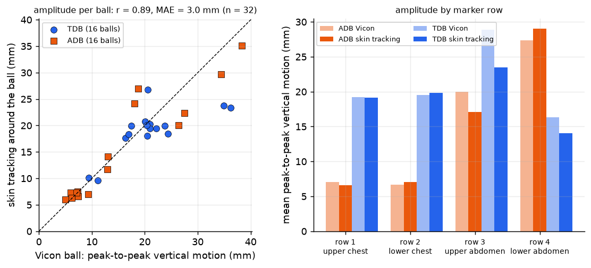
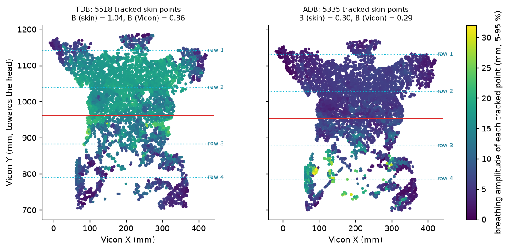
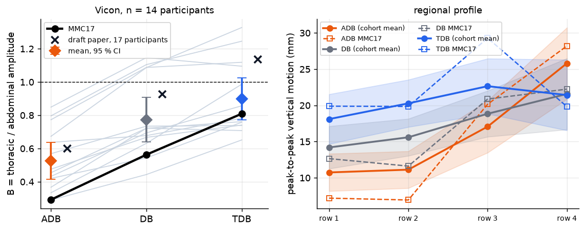

# Experiments

Twenty experiments, in the order they were done. Each was written up as a self-contained HTML page by `mv/make_reports.py` (`report_*.py`); those pages embed camera frames showing the participant and are therefore **not** in this repository. This file keeps the findings. "TDB" = thoracic-directed deep breathing, "ADB" = abdominal-directed deep breathing, "MMC17" = the participant whose data were used (study ID).

Setup of the main data set (MMC17): six GoPro HERO11 cameras on tripods in a ring around a treatment couch (T1-T6; camera T6 is unsynchronised and excluded), 4K, 29.97 fps; Vicon at 100 Hz with 72 reflective markers, 16 of them in a 4 x 4 array on the anterior torso (rows 1-2 chest, rows 3-4 abdomen). Frames are analysed every 3rd video frame from frame 250.

## Calibration and registration

| # | Experiment | Finding |
|---|---|---|
| 1 | **InstantHMR multi-view** on an earlier six-camera treatment-room data set (not included) | six-view fusion 33-47 ms per frame with tracking-mode boxes; accuracy on supine poses is the weak point |
| 2 | **Synchronisation** of that data set | stills were not synchronised; +-2 frame offsets halve the error in moving frames; the supine error is not a sync problem |
| 3 | **SAM 3D Body vs InstantHMR** there | same cross-view consistency (10.6 / 27.2 vs 9.0 / 27.1 px at 1080p); separating them needs ground truth |
| 4 | **MMC17 extrinsics** from the checkerboard clip (shared intrinsics, six board poses) | the reprojection RMS cannot see a wrong sub-grid alignment of the 6 x 5 corners inside the 7 x 5 board; a physical-layout prior chose wrongly for T4/T5; leave-one-camera-out error 2161 -> 104 px once the Vicon markers fixed it |
| 5 | **Vicon <-> GoPro** from the reflective balls found in the images (no pose model) | 465 matched markers, PnP RMS 1-1.7 px per camera, 0.5 mm triangulation check; implied checkerboard square 120.7 mm |
| 10 | **Recovering camera T6** | T6 had moved after the checkerboard clip; a marker pose search gives 104 matches at 2.05 px PnP; no clock drift, but it is not on the common clock, so it stays out |

ADB (raw video): see [Abdominal vs thoracic deep breathing](#abdominal-vs-thoracic-deep-breathing).

## Body mesh

| # | Experiment | Finding |
|---|---|---|
| 6 | **SAM 3D Body multi-view tracking** (skeleton triangulated from five cameras, overlays) | cross-view consistent in the image, but see 11 |
| 7-9 | **Marker-guided mesh fit** (MoSh-style: the Vicon markers pull the MHR mesh; markers attached to surface points, pseudo-Huber, three stages; arm/head markers labelled from the data-collection sheet and geometry, priority classes as weights) | median marker-to-surface distance 32-60 mm (SAM 3D Body) -> 11-26 mm on the first frames; arms and head are loosely constrained |
| 11 | **SAM 3D Body multi-view vs Vicon landmarks** | ~17 cm median even when triangulated: marker guidance is needed for a reference |
| 14 | **Marker-guided tracking over the whole trial** (291 frames, warm-started, fixed attachments) | 10.2 mm median marker-to-mesh vs 32.5 mm for SAM 3D Body; ~5.5 s per frame offline |
| 16 | **Markerless multi-view mesh** (one MHR body fitted to the five per-camera SAM 3D Body meshes; failing views gated per frame) | **41 mm** median distance to the Vicon markers vs 114 mm for a typical single camera (36 mm best, 243 mm worst); T3 is gated out in every frame; head and arms are worse than the best camera alone (63 vs 33 mm); the chest breathing is not improved (amplitude 9 vs 17 mm); lower internal residual does not mean lower error (a Cauchy loss agreed better between views and was worse against Vicon) |

## Breathing signal and skin tracking

| # | Experiment | Finding |
|---|---|---|
| 12 | **Review of the project and of other approaches** (incl. MoSE3-style dense motion) | chest-array breathing is ~rank 1 (94 % of the variance in the first mode, 16 participants / 45 trials) at ~15 mm peak-to-peak; SAM 3D Body's chest surface jitters ~4 mm (robust) with rare gross outliers; monocular dense-motion models are not accurate enough for a mm signal, hence the two-layer design |
| 13 | **Markerless chest tracking feasibility, with controls** | multi-camera Lucas-Kanade from a reference frame on skin/fabric texture: r = 0.983, MAE 0.92 mm against Vicon; resolution-independent down to 480 x 270 on matched points; seeds must lie within ~1-2 cm of the surface; wrong-phase / other-trial nulls are 3-9 mm |
| 15 | **Skin-only tracking with every ball painted out of the video** (Telea inpainting, windows kept away from the paint) | unchanged: r = 0.983, MAE 0.90 mm (balls visible: 0.92 mm); only 23 points survive the stricter masking |
| 17 | **Dense skin tracking** (4,000 seeds on the chest footprint) | **1,142** triangulated points at r = 0.985, MAE 0.85 mm (0.74 after best scale); seeds on SAM 3D Body's mesh: 1,120 points, 0.95 mm; seeds on the *markerless multi-view mesh*: 1,231 points, 1.03 mm (nothing from Vicon in the seeds); accepting 2-camera points: 2.3-2.8k points at the same accuracy. The 41 px window is 2.9 cm on the skin, so the field has ~190 independent patches; bare abdomen is the texture ceiling |

## Why the marker-guided fit is better

*Experiment 19.* Each Vicon marker is attached to a vertex of the marker-guided mesh; the same vertex on another mesh is the same anatomical place; the vector to the marker is split into **depth** (along the camera ray) and **lateral** (image plane).

* Single-camera SAM 3D Body: the **depth error dominates** and varies enormously between cameras: the chest is 13-31 cm too far from the camera in T1, T2, T3 and T5 and within ~1 cm in T4. The chest (pale top) shows the same error as the legs (black leggings), so it is not a clothing effect. Lateral errors are 2.5-6 cm for the best camera.
* The five-camera consensus removes most of the depth error (35 mm on the chest) and keeps a lateral error of ~3 cm.
* The Vicon markers are 3D anchors, so they fix exactly the quantity a monocular network cannot see.
* *Hold-out markers* (a fit with some markers hidden, scored on the hidden ones) and the *brightened-frame test for the dark leggings* are run by `marker_holdout.py` and `dark_clothing_test.py`; their results are in the table below once computed.

<!-- RESULTS_19 -->

## Sapiens2 cold start

*Experiment 20.* [Sapiens2](https://github.com/facebookresearch/sapiens2) gives 308-keypoint pose (top-down) and a 29-class body-part segmentation; MHR (the body model in SAM 3D Body) can output exactly the same 308 keypoints, so the mesh can be fitted to the detections directly.

* 0.4B models run locally in a Python 3.12 / torch 2.11 environment (`mv/sapiens2_run.py`): on the GPU 0.7 s (pose) + 0.3 s (parts) per crop; crops are the elongated person box rotated 90 degrees (head up).
* **Keypoints, triangulated from five cameras and compared with Vicon-derived joint proxies** (hip ~ trochanter, knee/ankle/wrist/elbow = midpoint of the paired markers, toes ~ metatarsal heads; absolute numbers are a few cm high for both methods because joint centres are 2-6 cm from skin markers): knees 30-35 mm, ankles 24-32 mm, wrists 26-33 mm, median over the landmarks **69 mm vs 161 mm** for SAM 3D Body's own skeleton triangulated from the same cameras.
* **Body-part segmentation** covers the black leggings as one clean lower-clothing region; the person mask agrees with the silhouette of the marker-guided mesh at IoU 0.83 / 0.85 in the two best cameras (T4, T3) and 0.76 median over the five cameras, against 0.61 for the markerless multi-view mesh.

<!-- RESULTS_20 -->
**Cold-start fit** (MHR fitted to the Sapiens2 keypoints of all five cameras, started from each camera's SAM 3D Body pose in turn, no Vicon and no SAM 3D Body mesh in the objective; 5 TDB frames; median marker-to-mesh distance in mm, same metric as experiment 16):

| Mesh | all markers | chest array | pelvis, legs, feet | head and arms |
|---|---|---|---|---|
| SAM 3D Body, best single camera (T4, picked with Vicon) | 34 | 26 | 44 | 36 |
| SAM 3D Body, typical single camera | 113 | 106 | 107 | 162 |
| SAM 3D Body multi-view consensus (markerless) | 41 | 22 | 44 | 64 |
| **Sapiens2 cold start, keypoints only** | 22 | 29 | 23 | 13 |
| marker-guided (reference, uses the markers) | 16 | 15 | 20 | 11 |

**The median hides a failure: the belly floats.** Height of each mesh's anterior surface above the skin under the 16 chest-array balls (highest vertex within 3 cm horizontally minus the ball height; + = the mesh floats above the skin; the marker-guided mesh reads +5 to +19 mm because of the 3 cm window and the ball radius):

| Mesh | row 1 (upper chest) | row 2 | row 3 (upper abdomen) | row 4 (lower abdomen) |
|---|---|---|---|---|
| cold start | +32 | +24 | +86 | +96 |
| multi-view | +24 | -27 | +28 | +34 |
| marker-guided | +19 | +5 | +15 | +10 |

* The cold-start abdomen sits **7-9 cm above the skin** (rows 3-4) and the chest 2-3 cm; the multi-view consensus is within 1-3 cm of the reference there. Keypoints say where the joints are, not how thick the belly is, and nothing in the fit constrains the surface between them.
* The segmentation looks right because the silhouette hardly sees it: the Sapiens2 person mask and the cold-start silhouette overlap at IoU 0.76 (marker-guided 0.80, multi-view 0.61), since from cameras looking down at oblique angles a belly 8 cm too high covers the same pixels. The keypoint-only fit never used the mask.
* Seeding skin tracking on this mesh fails: amplitude ratio 0.43-0.50 against Vicon (MAE 2.1-2.7 mm) versus 0.94-1.0 for seeds on the multi-view mesh.
* **Under test:** a body-part **mask term** (the mesh must cover the person pixels of every camera) and a **multi-view consensus term** (SAM 3D Body's dense surface cues, which are good on the torso, kept alongside the Sapiens2 skeleton); `sap_fit.py` options `W_SIL` and `W_MV`. Their results will be added here.

## Abdominal vs thoracic deep breathing

*Experiment 18.* The regional analysis of the accompanying draft manuscript: peak-to-peak vertical motion of the 16 anterior markers, thoracic = rows 1-2, abdominal = rows 3-4, **B = mean thoracic amplitude / mean abdominal amplitude** (B < 1 abdominal-dominant).

* **Vicon only, 14 participants with ADB, DB and TDB** (the manuscript has 17 and free breathing too): B = 0.53 (ADB), 0.77 (DB), 0.90 (TDB) (manuscript 0.60 / 0.93 / 1.14); Friedman p = 5e-6; ADB < DB < TDB for the cohort. Absolute amplitudes in this export are ~25-30 % smaller than the manuscript's table, so only direction and significance are reproduced. MMC17: B = 0.29 (ADB), 0.81 (TDB).
* **Skin tracking (video only), MMC17:** the ADB video is raw wide-angle footage, so a per-camera lens-correction warp into the stabilised-video geometry was fitted (fisheye model + rotation, ~1.5 px) and the extrinsics re-estimated from the ADB balls (RMS ~2 px). With the balls painted out and seeds on the markerless multi-view mesh, tracked skin points within 45 mm of each ball position were pooled into "virtual markers" and B computed as for the balls: **B = 0.30 (ADB) and 1.04 (TDB)**, Vicon 0.29 and 0.86. Amplitude per ball position, skin tracking vs Vicon, over both trials: **r = 0.89, MAE 3.0 mm** (n = 32); displacement over time: median error 0.93 mm.
* **Caveat:** the bare abdomen has little texture; the upper-abdomen row is under-estimated (15-20 %) and B is about 0.2 too high in TDB. B depends on the point-validity rule (TDB 1.04-1.27, ADB 0.30-0.46 across three rules), but the maneuvers stay separated under every rule.

